# Coordinated eVTOL Scheduling under Demand Uncertainty

This repository contains a reproducible research workflow for urban air
mobility demand estimation, stochastic scenario generation and reduction, and
risk-aware eVTOL charging and passenger scheduling in the Dallas-Fort Worth
region.

The project combines geospatial Census inputs, a gravity-based demand model,
non-homogeneous Poisson arrival scenarios, backward scenario reduction, and a
mixed-integer linear program with a CVaR risk term.

> **Research status:** This is an academic model under active validation. The
> included data and parameters support computational experiments; they should
> not be interpreted as an operational deployment plan.

## Workflow

```mermaid
flowchart LR
    A[ACS population + Census tracts] --> B[Geospatial allocation]
    B --> C[Gravity demand model]
    C --> D[Passenger and eVTOL arrivals]
    D --> E[Joint scenario generation]
    E --> F[Backward scenario reduction]
    F --> G[Conditional state-of-charge sampling]
    G --> H[Stochastic MILP + CVaR]
    H --> I[Results and interactive figures]
```



## Repository structure

```text
coord-schedule-uam/
├── .github/workflows/tests.yml      # Continuous integration
├── data/
│   ├── raw/                         # ACS JSON and TIGER/Line tract files
│   └── README.md                    # Data dictionary and provenance notes
├── docs/
│   └── MODEL_NOTES.md               # Scientific validation priorities
├── outputs/
│   ├── figures/                     # Generated interactive HTML plots
│   └── results/                     # Generated run summaries
├── src/coord_schedule_uam/
│   ├── config.py                    # Parameters and repository paths
│   ├── data_loading.py              # Census and geospatial processing
│   ├── demand_model.py              # Gravity model and arrival sampling
│   ├── scenario_generation.py       # Stochastic demand scenarios
│   ├── scenario_reduction.py        # Backward reduction
│   ├── model_construction.py        # Solver-ready scenario structures
│   ├── solution_algorithm.py        # PuLP optimization model
│   ├── visualization.py             # Plotly and Folium outputs
│   └── experiment_runner.py         # End-to-end orchestration
├── tests/                           # Fast unit and configuration tests
├── .env.example
├── .gitignore
├── pyproject.toml
└── requirements.txt
```

The original RAR archive and generated multi-megabyte HTML files are not part
of the organized source tree. They can be recreated from the documented
workflow.

## Installation

Python 3.10 or newer is required. From the repository root:

```bash
python -m venv .venv
```

Activate the environment:

```bash
# Windows PowerShell
.venv\Scripts\Activate.ps1

# macOS or Linux
source .venv/bin/activate
```

Install the project:

```bash
python -m pip install --upgrade pip
python -m pip install -e .
```

For tests and linting tools:

```bash
python -m pip install -e ".[dev]"
```

## Running the workflow

### Directly from the repository

The simplest option on Windows is the root-level launcher. From the repository
root, run:

```powershell
& C:/Users/novin/anaconda3/python.exe ./run_experiment.py --no-plots --skip-solve
```

Remove `--skip-solve` when you want to run the complete optimization model.

Do not launch files inside `src/coord_schedule_uam/` directly. They are package
modules and use relative imports such as `from .config import ...`.

### After installing the package

Run without opening or generating plots:

```bash
python -m coord_schedule_uam --no-plots
```

Run a fast pipeline smoke check that builds the optimization input but does not
solve the MILP:

```bash
python -m coord_schedule_uam --no-plots --skip-solve
```

Run the full workflow and write interactive HTML figures:

```bash
python -m coord_schedule_uam
```

Choose a reproducible random seed:

```bash
python -m coord_schedule_uam --seed 60 --no-plots
```

The optimization code tries the Python HiGHS interface first and then PuLP's
CBC solver. To use a specific HiGHS executable, set `HIGHS_PATH` in the shell:

```powershell
$env:HIGHS_PATH = "C:\path\to\highs.exe"
python -m coord_schedule_uam --no-plots
```

## Outputs

The workflow writes:

- `outputs/results/run_summary.json`: seed, scenario counts, solver status, and
  objective value.
- `outputs/figures/1_scenario_arrivals.html`: reduced arrival profiles.
- `outputs/figures/4_reduced_scenario_analysis.html`: four-panel comparison of
  the original and reduced scenario sets.

Generated outputs are intentionally ignored by Git so that commits remain
small and reviewable.

## Configuration

Experiment parameters are centralized in
`src/coord_schedule_uam/config.py`, including:

- time-of-use electricity prices;
- battery, charging, and aircraft capacity;
- experiment horizon and time-bin size;
- fleet and passenger counts;
- scenario generation and reduction sizes;
- CVaR-related model inputs;
- study-area bounds and vertiport coordinates.

All file paths are derived from the repository root. The workflow therefore
works from any current working directory after installation.

## Testing

```bash
python run_tests.py
python -m compileall -q src
```

The root test launcher adds `src/` to Python's import path automatically, so an
editable package installation is not required.

The current tests cover bundled-data paths, horizon configuration, time-of-use
pricing, and scenario probability preservation. Add regression tests for model
outputs as the mathematical formulation stabilizes.

## Data and reproducibility

The workflow reads a local 2022 ACS JSON snapshot and the Texas 2022
TIGER/Line census tract shapefile. It does not require a Census API key. See
`data/README.md` for details.

Randomness is seeded by the experiment runner. Solver versions and operating
systems can still produce small numerical differences, so record the Python
environment and solver version when reporting results.

## Known validation work

The repository layout and execution environment are productionized, but the
research formulation still needs targeted mathematical validation. In
particular, passenger-service indicators, aircraft departure timing, and CVaR
interpretation should be checked against the equations in the accompanying
paper. See `docs/MODEL_NOTES.md` before using results in a publication.

## License

No open-source license has been selected. Add an appropriate `LICENSE` file
before distributing this repository publicly.
